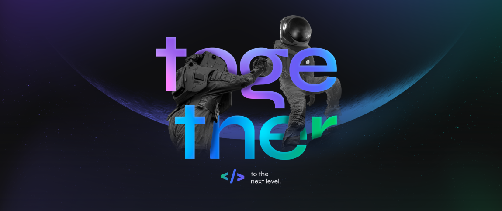

## NLW#6 - Trilha ReactJs - LetMeAsk

Projeto criado com a intenção de conhecer os serviços da Firebase e integra-los com uma aplicação em React.

O projeto consiste em uma aplicação para interação de espectadores com os apresentadores durante transmissões ao vivo. Os usuário podem enviar perguntas durante a apresentação ou curtir perguntas que já foram feitas, já o dono da sala pode excluir perguntas, destaca-las, marcar como respondidas e ao final encerrar a sala.

## 🛠 Tecnologias Utilizadas

- [TypeScript](https://www.typescriptlang.org/)
- [React](https://pt-br.reactjs.org/)
- [Firebase](https://firebase.google.com/)

## Conceitos aprendidos

- Fluxo de uma API
- Conceitos de React
  - Componente
  - Estado
  - Propriedades
- Modelos de Web
  - Web Tradicional
  - SPA -> Single Page Application
- Firebase
  - Autenticação
  - Autorização, regras de acesso
  - Tipos de bases de dados
  - Consultas, Inserções e Referências
  - Hospedagem do projeto
- Rotas e navegação com react-router-dom
- Context API
- React Hooks
  - useState
  - useEffect
  - Custom Hooks
- .env e Variáveis de Ambiente
- Estilização
  - SASS 

## NEXT LEVEL

- Criação do Modal com as estilizações fornecidas no figma
- Implementação do Modal no encerramento da sala e na exclusão das perguntas
- Exibição de salas sem perguntas
- Controle de salas encerradas
- Switch para modo dark/light
  

